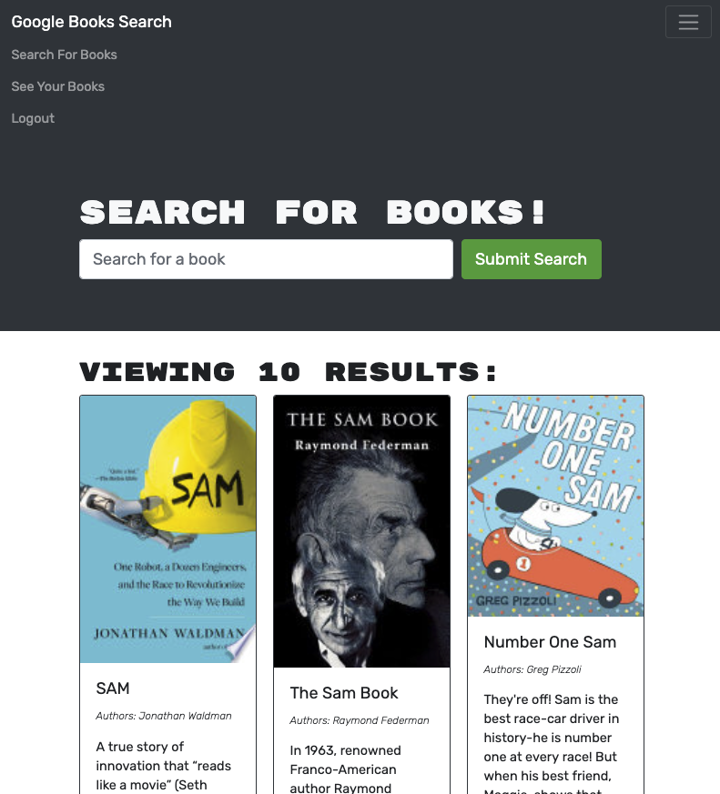

# Book Search Engine

## Description
Fully functioning Google Books API search engine built with a RESTful API refactor to be a GraphQL API built with Apollo Server. The app was built using the MERN stack, with a React front end, MongoDB database, and Node.js/Express.js server and API. 

## Github link 
[book-search](https://github.com/Wsamuell/book-search)
## Heroku link 
[heroku-book-search](https://book-search-gql.herokuapp.com/)

## Description 
A CMS-style blog site similar to a Wordpress site, where developers can publish their blog posts and comment on other developers’ posts as well.

## Screenshot Images

### User Story
* AS AN avid reader
* I WANT to search for new books to read
* SO THAT I can keep a list of books to purchase
